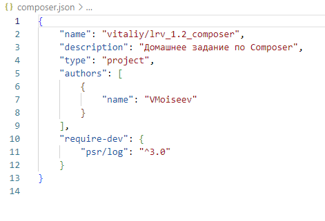

## Задание 2. Установка composer

## Дополнительное задание (со звёздочкой)

1. Разница между файлами composer.json и composer.lock:

composer.json - содержит информацию о проекте, включая список используемых зависимостей (с указанием их версий).

composer.lock - зафиксированы конкретные версии зависимостей, создаётся автоматически при выполнении команды 'composer install' или 'composer update'

2. Разница между директивами require-dev и require внутри файла composer.json:

require-dev - устанавливаются зависимости только для разработки

require - устанавливаются зависимости, используемые в итоговой сборке для заказчика

3. Разница между запуском команды composer install и composer update:

composer install - первая установка зависимостей из файла composer.json

composer update - обновление зависимостей файла composer.lock на основе изменений в файле composer.json